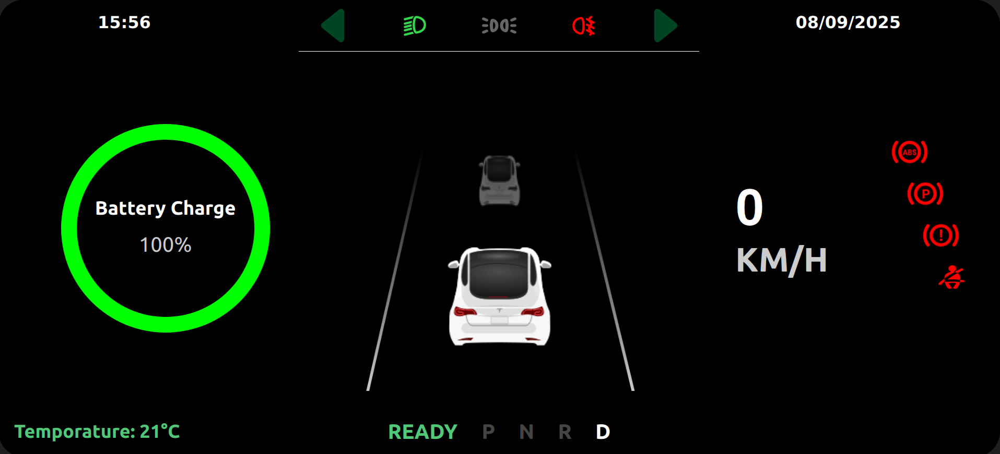
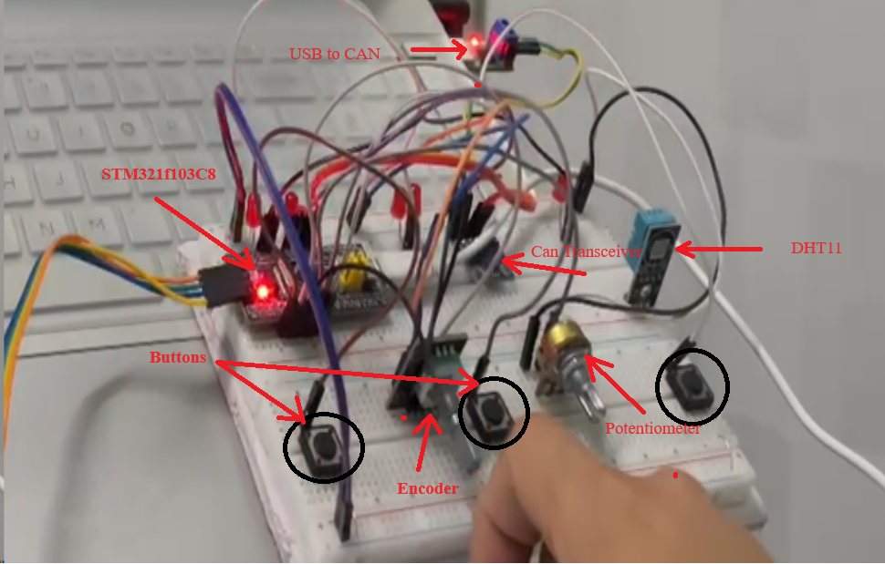
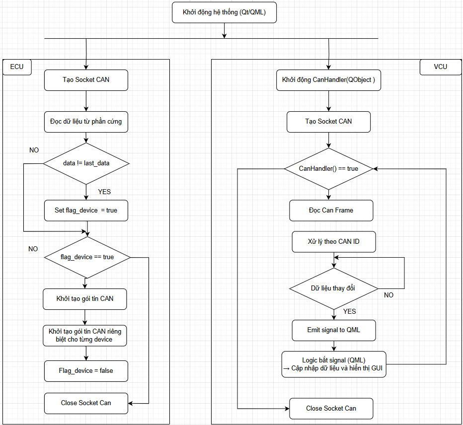

# Simulation of Cluster Display System in Automotive
Simulation of an automotive system featuring a **Digital Instrument Cluster (IPC)** and a **Vehicle Control Unit (VCU)** for electric vehicles, built on hardware platforms such as **Raspberry Pi** and **STM32 microcontroller**, and utilizing the **CAN Bus** communication protocol. The VCU is responsible for managing vehicle states, while STM32-based **Electronic Control Unit (ECU) nodes** run a common firmware to ensure scalability and deployment flexibility. This system demonstrates an **Electrical and Electronic (E/E) Architecture**, incorporating both **Domain-Centralized E/E Architecture** and **Zonal E/E Architecture**, and combined with **Human–Machine Interface (HMI** design in compliance with **ISO 2575** for symbols and displays as well as **ISO 26262** for functional safety. At the same time, the CAN bus standard is employed to guarantee real-time data exchange between the VCU, IPC, and ECUs, establishing a platform for research and development suitable for smart automotive applications.

## Key Features.

- **Digital HMI:** HMI design based on Qt/QML displaying vehicle speed, battery level, distance traveled, temperature, gear position (P, R, N, D), and warning indicators in compliance with ISO 2575 for symbols and displays.
- **VCU with CAN Bus Communication:** VCU manages vehicle states and I/O, enabling real-time communication with ECUs via CAN bus.
- **SocketCAN in Linux:** Integrated SocketCAN on Raspberry Pi to send/receive CAN frames in real, enabling real-time communication with ECUs via CAN bus. Supports CAN analysis tools (candump, cansend, can-utils, e.g.) for debugging and logging data.
- **Real-Time Processing:** Low-latency data handling with ADC via DMA. FIFO queues for CAN frames and Qt signal-slot mechanism.
- **Human–Machine Interface (HMI):** Intuitive and user-friendly interface design, compliant with functional safety principles defined in ISO 26262.
## System Requirements.

### Hardware.

- Raspberry Pi 4 Model B (4GB Ram, 4-core).
- STM32f103c8t6 (ARM Cortex-M3, 72MHz, with CAN transceiver SN65HVD230).
- USB to CAN adapter (e.g., Makerbase CANable v1.0) for Raspberry Pi
- Inputs: Potentiometer (Batterry simulation), Encoder (Speed simulaton), temperature sensor, buttons (turn left, right signals, light, ....)
- Outputs: LEDs,...

### Software.

- Linux OS (custom Yocto image recommended)
- Qt 5 with Qt Creator for HMI development
- STM32CubeIDE for ECU firmware
- SocketCAN for Linux CAN communication
- GCC cross-compiler for ARM
- Yocto Project for building custom Raspberry Pi images

## Illustration.

### Video demo of project results: [Google Drive Link](https://drive.google.com/file/d/1ATdEQX1CZ-gO_pBWa4IgX9KCj8kmD0T1/view?usp=sharing)

### Demo My HMI on Qt Creator.

### Image of Hardware.

## Workspace Structure.
### Flowchart

## Contributing.

We welcome contributions from the community! 🎉

To contribute:
1. Fork this repository
2. Create your feature branch (`git checkout -b feature/my-feature`)
3. Commit your changes (`git commit -m 'Add some feature'`)
4. Push to the branch (`git push origin feature/my-feature`)
5. Open a Pull Request

Please make sure your code follows our coding style and passes all tests.
If you find a bug or have an idea for improvement, feel free to open an Issue first.

Thank you for contributing! 🙌

## References.
- Build Image in Yocto Project: [Yocto Project](https://devlinux.vn/blog/Build-Image-cho-Raspberry-Pi-Zero-W)
- Qt Documentation: [doc.qt.io](https://doc.qt.io)
- SocketCAN Documentation: [docs.kernel.org/networking/can.html](https://docs.kernel.org/networking/can.html)
- STM32 Reference Manual (RM0008): STMicroelectronics (2018)
- Electrical / Electronic Architecture Overview: [E/E Architecture Overview](https://www.linkedin.com/pulse/automotive-ee-architecture-introduction-jinesh-vinayachandran-nzanc/)
- ISO 26262: Road vehicles – Functional safety (2018)
- ISO 2575: Road vehicles – Symbols for controls, indicators and tell-tales (2024)

## Contact

For issues or inquiries, open a GitHub issue or contact [bocdo210@gmail.com]
